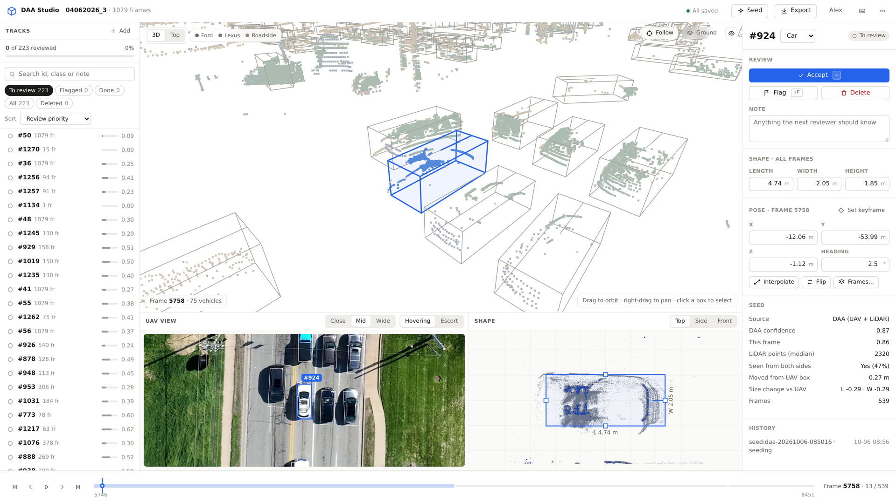

# DAA Studio

A browser app for labeling 3D vehicle boxes in ground LiDAR, starting from what a drone sees. It is
built on **DAA (Drones as Annotators)**, the method in our paper
[*Drones as Annotators: Amodal 3D Auto-Labeling for Ground LiDAR with Aerial Priors*](https://arxiv.org/abs/2609.06819)
(arXiv:2609.06819).

**Why a drone.** A LiDAR on a vehicle or at the roadside sees each car from one side, often only in
part, and loses it whenever something passes in between. Its full 3D box, including the hidden parts,
is therefore hard to label, by hand or automatically. A drone hovering overhead sees the same vehicles
without occlusion, as continuous tracks through the whole recording.

**DAA and DAA pseudo labels.** DAA initializes each 3D box from these occlusion-free, continuous
UAV-derived vehicle tracks: the UAV detection is projected to the LiDAR map with a default height. An
EM-like refinement then fits the box to the vehicle's points in every ground LiDAR, keeping one shape
per vehicle across all frames. It needs no training. The boxes it produces are the **DAA pseudo
labels**: a strong starting point that a person reviews and corrects, instead of drawing every box
from scratch.

DAA Studio runs DAA inside the app, shows the drone's view next to the LiDAR, and works directly on an
OpenCOOD session folder of the air-ground dataset. It supports three ways of working:

- **Review DAA pseudo labels.** Accept, fix or flag each track. The review queue puts the weakest
  tracks first.
- **UAV-assisted manual labeling.** Start from the raw UAV detections, or from nothing, and click
  vehicles in the drone image to add them.
- **Auto-labeling.** Export the DAA pseudo labels as they are, and review only what you want.



**Walkthrough video (2½ min):**
[1080p](https://github.com/tanz1230/daa-studio/releases/download/v1.0.0/daa_studio_walkthrough_1080p.mp4) ·
[4K](https://github.com/tanz1230/daa-studio/releases/download/v1.0.0/daa_studio_walkthrough_4k.mp4)
(release [v1.0.0](https://github.com/tanz1230/daa-studio/releases/tag/v1.0.0)). It shows creating a
project, seeding it with DAA, the editor, reviewing, fixing a box, adding a missing vehicle from the
drone image, and exporting. In the add-a-vehicle scene the missing car is simulated: one parked car was
left out of the UAV detections for the demo.

A label lives in a **project**. The dataset itself is never modified, unless you explicitly choose
"Write into the dataset" when exporting.

## Data you need

DAA Studio is only the tool; it contains no data. For each recording session you bring:

**1. A session folder** in the OpenCOOD layout used by the AGI-COOP air-ground dataset, e.g.
`…/agi_coop/take_3`:

```
take_3/
  0/  1/  2/             ground LiDARs: two vehicles and one roadside unit
                         <frame>.pcd   the sweep
                         <frame>.yaml  lidar_pose, and for agents 0 and 1 the labels (`vehicles`)
  3/  4/                 UAV cameras (hovering, escorting): <frame>.jpg
  camera_3.json          UAV camera models: intrinsics, distortion, per-frame map -> camera pose,
  camera_4.json          ground homography and ground plane
  annotation_area.json   optional
```

All poses and boxes share one map frame. The UAV folders are optional: without them there is no
drone view, and vehicles can only be added in the 3D view.

**2. UAV detections**, for DAA seeds or UAV-only seeds: a CSV with one row per vehicle and frame,
boxes in the same map frame.

| Column | Meaning |
|---|---|
| `frame_idx` | the LiDAR frame (rows for frames outside the session are skipped and reported) |
| `track_id` | the vehicle's track ID, stable through the session |
| `cx`, `cy`, `cz` | box centre (m); `cz` may come from a default height |
| `L`, `W`, `H` | box size (m); a median `H` of 2 m or more marks a large vehicle |
| `yaw` | heading (rad) |
| `conf` | optional detection score |

The wizard fills the file in when it finds `uav_detections.csv` in the session folder or
`uav_detections/<session>.csv` next to it; otherwise you choose it.

**3. A terrain model** (optional, recommended): `dtm.npz` holding `grid` (ground elevation in metres
on a regular UTM grid, NaN where unknown), `x_min`, `y_min` and `cell_size`, plus
`T_utm_to_local.txt`, the 4 × 4 transform from UTM to the map frame. It removes the ground from the
LiDAR, which DAA expects, and stands new boxes on the ground. See *Requirements and troubleshooting*
for where the app looks for it.

**4. Existing labels** (optional), to correct instead of seeding: the `vehicles` blocks already in
the session's YAML files, or a label CSV with the same columns as the detections.

## Quick start

```bash
pip install -r requirements.txt     # numpy, scipy, pyyaml, opencv-python-headless
./run.sh                            # Windows: run.bat     (or: python -m studio serve)
```

This opens `http://127.0.0.1:8765` in your browser; Chrome, Edge or Firefox work. Then:

1. Click **New project** and pick a session folder, e.g. `…/agi_coop/take_3`.
   The session is checked as you type: frames, LiDARs and UAV cameras are listed.
2. Choose the **seeds**. DAA is recommended. The matching UAV detections file is filled in when the
   app finds one.
3. Choose the **ground LiDARs** (all of them gives the best seeds) and the UAV camera to show.
4. Name the project and choose its folder. By default it is created next to the dataset.

Seeding runs in the background. Tracks appear in the list as they finish (DAA needs a few minutes per
take: 2–5 on a 12-core machine), and you can start reviewing at once.

## The editor

| Area | What it is for |
|---|---|
| **Tracks** (left) | The review queue: filters (To review, Flagged, Done, All, Deleted), search, sort, progress. |
| **3D / Top view** (centre) | This frame's LiDAR and every box. In **Top** view the selected box has handles: drag the body to move it, an edge to resize it (the opposite face stays put), the ring to rotate it. Hold Shift to apply the change to the whole track. |
| **UAV view** | The drone's image of the vehicle with all boxes projected through the camera model. Click a box to select it. |
| **Shape** | Every frame's points of the track overlaid in the box frame. A crisp blob means the boxes are right; a smear means some frame is off. Drag a face to set the shared length, width or height. |
| **Inspector** (right) | The review buttons, exact numbers (shape, pose), the seed's diagnostics and the edit history. |
| **Timeline** (bottom) | Scrubs through the track's frames (Alt scrubs through any frame). Purple ticks mark edited frames, amber ticks mark frames where DAA was unsure, diamonds mark keyframes. |

**Reviewing.** Press **N** to take the first track in the queue. Then press **Enter** to accept it
and move on, **Shift+F** to flag it with a reason, or **Del** to delete it. All three move to the next
track. A track you have edited counts as reviewed.

**Fixing.** Each vehicle has **one shape** (L, W, H) and **one pose per frame**. Use resize handles,
the Shape panel or the L/W/H fields to set the shape for all frames. Move or rotate the box in a
single frame, or hold Shift to move the whole track. **X** re-derives a frame from its neighbours; on
a frame without a box, **X** creates one. To interpolate a stretch, mark one end with **M**, go to
the other end and press **Shift+X**.

**Adding a missed vehicle.** Press **A** (or click **Add**), then click the vehicle in the 3D/Top
view **or in the drone image**. The drone image works even when the LiDAR has no points on it. The
new box stands on the ground and takes its heading from the nearest vehicle. To make it cover more
frames, use **Frames…** in the inspector:

- **Fill the gaps (interpolate)** — for a moving vehicle with boxes on some frames.
- **Parked: copy this box to every frame** — for a vehicle that does not move.

Saving is automatic, and the header shows **All saved**. **Ctrl+Z / Ctrl+Shift+Z** undo and redo
every operation, including deletes and status changes.

## Keyboard

| Review | | Frames | |
|---|---|---|---|
| Accept & next | Enter | Next / previous frame | . / , |
| Flag | Shift+F | ±10 frames | > / < |
| Delete track | Del | First / last frame | Home / End |
| Next / previous track | N / P | Play / pause | Space |
| Add a missed vehicle | A | Search tracks | / |

| This frame | | Whole track | |
|---|---|---|---|
| Nudge 5 cm (Shift: 20 cm) | arrows | Rotate ∓0.5° | { / } |
| Rotate ∓0.5° | [ / ] | Length / width / height | I K · J L · U O |
| Raise / lower 5 cm | = / - | Mark keyframe | M |
| Interpolate or create from neighbours | X | Interpolate mark → here | Shift+X |
| Flip heading | Y | Flip mark → here | Shift+Y |

| View and edit | |
|---|---|
| 3D / Top | V |
| Fit to vehicle | F |
| Ground points | G |
| One sensor / all | 1 2 3 / 0 |
| Undo / redo | Ctrl+Z / Ctrl+Shift+Z |
| All shortcuts | ? |

## Seeds

| Seeds | What you get |
|---|---|
| **DAA** (recommended) | Amodal boxes. Each UAV-detected vehicle is fitted to the LiDAR you select, and every vehicle keeps one shape across frames. This is the paper's adopted configuration: the relative prior floor δ = 0.3 m, with the width read from the M-step. |
| **UAV detections only** | The UAV detection projected to the LiDAR map with default heights. Fast, for manual labeling with UAV assistance. |
| **Session labels** | The annotations already in the session, for correcting them. |
| **Label CSV** | Any labels in the DAA CSV format, e.g. another run or tool. |

**Re-seeding is safe.** If you re-seed a project (Seed button), only tracks nobody has touched take
the new seeds. Anything accepted, edited, flagged or added by hand stays as it is.

**Review priority.** Each DAA track carries diagnostics, shown under *Seed* in the inspector:

- DAA confidence (overall and for this frame)
- the median number of LiDAR points on the vehicle
- whether the LiDAR saw both sides of it
- how far DAA moved it from the UAV box
- how much the length and width changed

The queue orders tracks by
`risk = (1 − confidence) + 0.25·[points < 20] + 0.25·[one side only] + 0.25·min(shift, 1 m)`,
so the least certain tracks come first. A vehicle with no LiDAR points keeps the UAV box, and the
inspector says so.

## Projects, saving and safety

```
<project>/
  project.json        session, sensors, UAV camera, name
  tracks/<id>.json    one file per vehicle: shape, per-frame poses, status, flags, note, seed
  tracks/.prev/       the previous version of every track file
  history.jsonl       who did what, when, to which track (every save)
  seeds/<run>/        each seeding run: batches, labels.csv, meta.json (inputs, configuration)
  cache/crops/        LiDAR crops per track for the Shape panel
  jobs/               seeding logs
  exports/            default export location
  backups/            original dataset files, if you ever write into the dataset
```

- **Several annotators can share one project.** Every save carries the version it was based on. If
  someone else saved the same track in the meantime, your save is refused: their version loads, and
  a message says so. Nothing is overwritten silently.
- **Losing the connection** keeps your edits queued. The header shows *Offline — retrying*, and the
  edits go through when the server is back.

## Export

**Export** in the header writes either format:

- **OpenCOOD YAML.** A full mirror of the session with your boxes as the `vehicles` of the two
  ground vehicles (agents 0 and 1). The cameras and the annotation area are copied, and
  `provenance.json` records what was exported, by whom and from which seeds.
- **DAA CSV.** One row per vehicle and frame. This is the same format the seeds and the benchmark
  use.

You can export the **reviewed tracks only** (accepted, edited and added: human-verified labels) or
**everything except deleted** (unreviewed DAA pseudo labels included). **Write into the dataset**
replaces the session's label YAMLs in place, after a confirmation. Each file is backed up to the
project's `backups/` folder once, before it is first overwritten.

## Working as a team

```bash
./run.sh --host 0.0.0.0 --project /data/projects/take_3
```

Annotators open `http://<this-machine>:8765`. Each person enters their name once; it is recorded with
every edit.

## Command line

```
python -m studio serve   [--project P] [--port 8765] [--host 127.0.0.1] [--no-browser] [--user NAME]
python -m studio new     --project P --session S [--name N] [--sensors 0,1,2] [--uav 3]
python -m studio seed    --project P --mode daa|uav|session|import [--detections CSV] [--labels CSV]
                         [--sensors 0,1,2] [--workers N] [--limit N] [--import]
python -m studio export  --project P --format yaml|csv --out PATH [--all | --statuses a,b]
python -m studio info    SESSION
```

`seed --import` runs seeding without the app, for example on a server, and imports the result into
the project.

## Requirements and troubleshooting

- Python ≥ 3.9 with numpy, scipy, pyyaml and opencv-python-headless, plus a browser with WebGL.
  Nothing else: the server is the Python standard library, and three.js is bundled under
  `web/vendor/`.
- **Terrain model.** Ground removal uses the site's terrain model, two files that are not part of this
  repository: `dtm.npz` and `T_utm_to_local.txt`. The app looks for them in the folder named by
  `DAA_STUDIO_DTM_DIR`, then in the session folder, the dataset root, and `studio/assets/`. Without
  them the viewport shows *No ground model* and ground points stay in view; DAA seeding, which expects
  LiDAR with the ground removed, then gets the ground points too. New boxes still stand on the ground
  plane from the UAV camera file.
- **No drone image?** The UAV view is empty for frames the drone did not record. Vehicles at the
  edge of the drone's image appear at the edge of the view.
- **Sharing the machine** (e.g. while a model trains): set `DAA_STUDIO_WORKERS=4` to cap how many processes
  DAA seeding uses (default: up to 12), and start the app with `nice -n 19 ./run.sh` so it yields the CPU.
- **Client errors** are written to `~/.daa_studio/client.log` (set `DAA_STUDIO_HOME` to move it, along
  with the settings and the recent-projects list).

## Citation

If you use DAA Studio or DAA pseudo labels, please cite:

```bibtex
@misc{zhu2026drones,
  title         = {Drones as Annotators: Amodal 3D Auto-Labeling for Ground LiDAR with Aerial Priors},
  author        = {Tianheng Zhu and Zhenhao Wang and Yiheng Feng},
  year          = {2026},
  eprint        = {2609.06819},
  archivePrefix = {arXiv},
  primaryClass  = {eess.IV},
  url           = {https://arxiv.org/abs/2609.06819}
}
```

## For developers

```
studio/            Python package: server.py (stdlib HTTP), api.py (routes), session.py (read-only
                   release access), camera.py (UAV camera model), project.py (versioned store),
                   labels.py (label operations), export.py, importers.py, jobs.py, daa/ (vendored
                   DAA), seeding/ (UAV detections -> LiDAR crops -> DAA, as a background process)
web/               the app: index.html, css/studio.css (design system), js/ (ES modules, no build
                   step): app.js shell, store.js state and save queue, ops.js (mirror of labels.py),
                   views/ (viewport, UAV, shape, timeline, inspector, track list, dialogs)
tests/             unit tests (Python) and ui/ (headless-Chrome smoke test and its CDP driver)
```

`web/js/ops.js` and `studio/labels.py` implement the same operations under the same names. Change
them together.

**Tests.** `python -m unittest discover -s tests -t .` covers I/O, poses, the camera model, label
operations, the project store, export, DAA parity, seeding, background jobs and the HTTP API; tests
that need the dataset are skipped when it is not there. `python tests/ui/smoke.py --project <a seeded
project>` drives the real UI in headless Chrome through 15 workflows (review, edit, undo, add,
export…) and checks each result on the server; it works on a copy.
